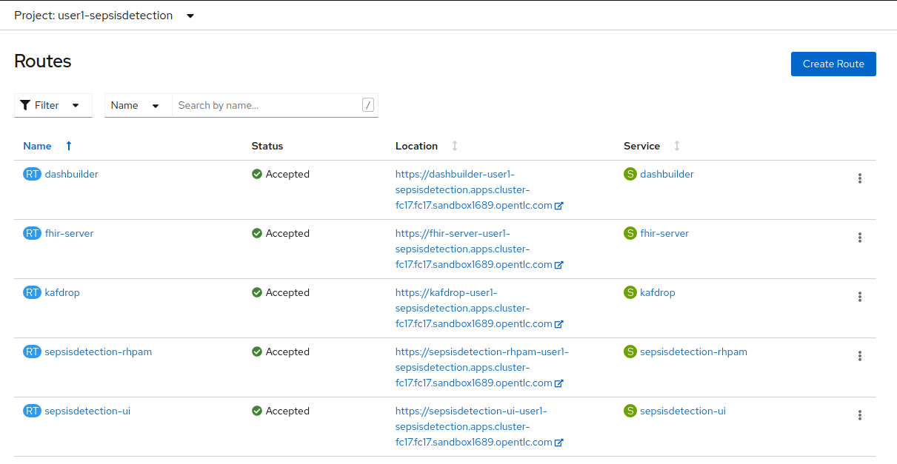

:scrollbar:
:data-uri:
:toc2:
:linkattrs:

= Sepsis Detection Demo
:numbered:

== Purpose

TO-DO

== Architecture

===  Sepsis Detection Runtime processes:

. _sepsisdetection_ parent process
+
image::sepsisdetection-kjar/src/main/resources/com/demo/sepsis/sepsisdetection-svg.svg[]

. _highmediummitigation_ Subprocess: 
+
image::sepsisdetection-kjar/src/main/resources/com/demo/sepsis/highmediummitigation-svg.svg[]

=== Reference Architecture

image::docs/images/reference_architecture_actual.png[]

. An external client POSTs a FHIR R4 _bundle_ (with a Patient, Location and multiple Observation resources ) to the RESTful API of the HAPI FHIR JPA server.
. HAPI FHIR JPA Server persists (using Hiberate) to its PostgreSQL database.  FHIR resources are stored as gzip blobs in the following table of the HAPI FHIR database schema:  _public.hfj_res_ver_ .
. Debezium detects the additional records to the _public.hfj_res_ver_ table and puts them in motion by sending the raw GZIP blobs to a kafka topic:  _fhir.public.hfj_res_ver_
. Messages in the _fhir.public.hfj_res_ver_ topic can now be viewed via monitoring tools such as _KafDrop_.  The _sepsisdetection_rhpam_ application is also a consumer on that topic.  During consumption of a Patient resource, the following occurs: 
.. Given a patiend ID, the RESTful API of the HAPI FHIR server is queried for a list of all _Observation_ resources for the Patient in a given time period.  This list of Observation resources is used as the payload of an HTTP POST request to the _sepsisdetection-ml_ function.  The function responds with an indication of whether sepsis is likely or not.

.. A FHIR R4 _RiskAssessment_ resource (which includes the data indicating likelyhood of sepsis) is posted to the FHIR Server via its RESTful APIs.
.. The RH-PAM _process-engine_ embedded in the _sepsisdetection-RHPAM_ application is invoked and a _sepsis-detection_ business process is started.  These business process and corresponding human tasks can be monitored via tools such as RH-PAMs _dashbuilder_ component.

. The _sepsisdetection-ui_ application interacts with the RESTful _KIE-Server_ APIs of _sepsisdetection-rhpam_ and renders a user interface that allows for management of the _sepsis-detection_ business process and corresponding human tasks.

. The _sepsisdetection-ui_ pulls in an IFrame from HealthFlow.

== Deploy to OpenShift
Ansible is included to deploy this application to OpenShift in a repeatable manner.

=== Pre-reqs:

. OpenShift Container Platform version 4.7.* or more recent.  Resource requirements needed by the app (doesn't include resource requirements of Openshift to support itself) is as follows:
.. RAM: 6 GB
.. CPU: 8
.. Storage: 10 PVCs of type RWO (no RWX requirement) and each of size 5 GiB
. cluster-admin credentials to this OpenShift cluster are needed
. Corresponding `oc` utility installed locally
+
All versions of this utility are available at either of the following:

.. https://access.redhat.com/downloads/content/290
+
RHN subscription required
.. https://mirror.openshift.com/pub/openshift-v4/clients/ocp/?C=M;O=D
+
Accessible without a RHN subscription

. ansible installed locally
+
ie: `dnf install ansible`

. git installed locally

=== Procedure:

. Using the `oc` utility that corresponds to the version of OpenShift that you will deploy to, log into the cluster: 
+
-----
$ oc login <OCP API Server url> -u <cluster-admin userId> -p <passwd>
-----

. Clone the source code of this project:
+
-----
$ git clone https://github.com/redhat-naps-da/himss_interoperability_showcase_2021
-----

. Change to the _ansible_ directory of this project: 
+
-----
$ cd ansible
-----

. Deploy to OpenShift:
+
-----
$ ansible-playbook playbooks/install.yml
-----

.. Deployment should complete in about 15 minutes.

.. Notice the creation of a new OCP namespace where the application resides:  user1-sepsisdetection

.. At the completion of the installation, expect to see messages similar to the following:
+
-----
...

PLAY RECAP *******************************************************************************************************************************************************************************************************
localhost                  :  ok=137  changed=77   unreachable=0    failed=0    skipped=14   rescued=0    ignored=0
-----

. Optional:  Uninstall from OpenShift:
+
-----
$ ansible-playbook playbooks/uninstall.yml
-----

== User Interfaces

As seen in the list of routes created in the _user1_sepsisdetection_ namespace, the demo provides the following user interfaces and APIs:

==== Red Hat SSO

image::docs/images/rh-sso.png[]

==== Dashbuilder

image::docs/images/dashbuilder_tasks.png[]

==== Hapi FHIR Server

image::docs/images/hapi_fhir_home.png[]

==== Kafdrop

image::docs/images/kafdrop_home.png[]

image::docs/images/kafdrop_message.png[]

==== Sepsisdetection-rhpam

This service consists of the RH-PAM _process_engine_ embedded in SpringBoot.

.. This service consumes messages from Red Hat AMQ Streams
.. This service also exposes the following RESTful APIs:
... KIE-Server REST APIs:

.... Swagger documentation is available in json format as per the following:
+
-----
$ curl -v -u "kieserver:kieserver" https://$(oc get route sepsisdetection-rhpam -n user1-sepsisdetection --template='{{ .spec.host }}')/rest/swagger.json | jq .
-----

..... swagger-ui:
+
Point your browser to the output of the following:
+
-----
$ SEPSISDETECTION_RHPAM_URL=https://$(oc get route sepsisdetection-rhpam -n user1-sepsisdetection --template='{{ .spec.host }}')

$ echo -en "\n$SEPSISDETECTION_RHPAM_URL/rest/api-docs/?url=$SEPSISDETECTION_RHPAM_URL/rest/swagger.json\n"
-----
+
image::docs/images/swagger-ui.png[]

... FHIR Enabled REST APIs:
+
Augments the RH-PAM KIE-Server with additional APIs that allow for handling FHIR related process and task variables

==== Sepsisdetection-UI

image::docs/images/sepsisui-home.png[]

== Demo Scenario

The demo scenario involves 3 different users each with different roles.

An _Administrator_ starts a business process.
A _doctor_ reviews the state of the business process and administers any tasks assigned to she/he .
A _provider_ then administers any tasks assigned to she/he .

=== Reset Demo

. Point your browser to the output of the following command: 
+
-----
$ echo -en "\nhttps://$(oc get route sepsisdetection-ui -n user1-sepsisdetection --template='{{ .spec.host }}' )\n"
-----
+
image::docs/images/sepsisui-login.png[]
+
Use credentials of:   _pamAdmin / pam_

. Click the _Reset Demo_ button: 
+
image::docs/images/sepsisui-admin-no-process.png[]

. After a few seconds, there should be an active business process:
+
image::docs/images/sepsisui-singleprocess.png[]

. Click the _Log out_ button at the top right corner to log out as an Administrator.

=== Doctors:   Administer Tasks

. Log back into the Sepsis Detection UI as a _doctor_.
+
Use credentials of:   _eve / pam_.

. Click `Show/Hide Workflow`:
+
image::docs/images/sepsisui-risk_assessment.png[]
+
Notice the timer on the _Primary Doctor Evaluates Risk_ task.
For the purpose of the demo, this timer is set to 1 minute.
If not administered within 1 minute of creation, the workflow will automatically route to the _On Call Doctor Evaluates Risk_ task.

. Click the `My Tasks` tab: 
+
image::docs/images/sepsisui-singletask.png[]

. On any of the tasks, click the _Open_ button and decide on an appropriate course of action.
+
image::docs/images/sepsisui_risk_evaluation.png[]

.. Select one of the options from the _Risk Evaluation Result_ drop-down.
.. Click _Submit_.

. Click the _Log out_ button at the top right corner to log out as a _doctor_.

=== Providers:  Administer Tasks

. Log back into the Sepsis Detection UI as a _provider_.
+
Use credentials of:   _bob / pam_.

. Similar to what you already did as a simualated _doctor_, manage the lifecycle of any tasks assigned to a _provider_.

== Local containerized environment

This project includes a _docker-compose_ config file that allows for deployment of the application as containers in your local environment.

. Start application pod with all linux containers:
+
-----
$ docker-compose -f etc/docker-compose.yaml up -d
-----
+
NOTE:  If underlying linux container system in use in your local environment is podman, then follow this link:https://fedoramagazine.org/use-docker-compose-with-podman-to-orchestrate-containers-on-fedora/[set-up guide].

. The following diagram depicts the containers instantiated as part of this pod:  
+
image::docs/images/docker-compose-architecture.png[]

. Post Debezium configs to kafka_connect container:
+
-----
$ curl -X POST \
        -H "Accept:application/json" -H "Content-Type:application/json" \
        localhost:8083/connectors/ \
        -d "@etc/hapi-fhir/debezium-fhir-server-pgsql.json"
-----
+
NOTE:  This step is not needed when running the solution in OpenShift.  It's only needed when running the solution in a local containerized environmennt (ie:  docker-compose)

. Stop application pod with all linux containers:
+
-----
$ docker-compose -f etc/docker-compose.yaml down
-----

. Test HAPI FHIR Server CORS headers using a _preflight_ request:
+
-----
$ curl -i -X OPTIONS -H "Origin: http://localhost:7080" \
    -H 'Access-Control-Request-Method: POST' \
    -H 'Access-Control-Request-Headers: Content-Type, Authorization' \
    "http://localhost:8080/fhir"

HTTP/1.1 200 
Vary: Origin
Vary: Access-Control-Request-Method
Vary: Access-Control-Request-Headers
Access-Control-Allow-Origin: *
Access-Control-Allow-Methods: GET,POST,PUT,DELETE,OPTIONS,PATCH,HEAD
Access-Control-Allow-Headers: Content-Type, Authorization
Access-Control-Expose-Headers: Location, Content-Location
-----

== Test
The sepsisdetection-rhpam deployment is enabled with the _kie_server_ as well as various endpoints that can consume FHIR payloads.

=== POST Patient to HAPI FHIR Server

The application includes a HAPI FHIR Server that exposes RESTful endpoints.

The demo scenario starts by submitting an HTTP POST with a FHIR bundle (which includes a FHIR R4 Patient) to the HAPI FHIR Server. 

. Set FHIR_SERVER_URL env var:

.. If testing environment deployed to OpenShift:
+
-----
FHIR_SERVER_URL=http://$(oc get route fhir-server -n user1-sepsisdetection --template='{{ .spec.host }}')
-----

.. If testing environment deployed locally:
+
-----
FHIR_SERVER_URL=http://localhost:8080
-----

. POST Demo Observation to FHIR server
+
-----
$ curl -X POST \
       -H "Content-Type:application/fhir+json" \
       $FHIR_SERVER_URL/fhir \
       -d "@sepsisdetection-rhpam/src/test/resources/fhir/DemoBundle.json"
-----

. POST Test Observation to FHIR server
+
-----
$ curl -X POST \
       -H "Content-Type:application/fhir+json" \
       $FHIR_SERVER_URL/fhir \
       -d "@sepsisdetection-rhpam/src/test/resources/fhir/ObservationPatientBundle.json"
-----

=== SepsisDetection RHPAM

. Set the following environment variables with values similar to the following:
.. If testing environment deployed locally:
+
-----
SEPSISDETECTION_RHPAM_URL=http://localhost:9080
RHSSO_URL=http://localhost:4080
retrieve_token_url="$RHSSO_URL/auth/realms/kieRealm/protocol/openid-connect/token"
-----

.. If testing environment deployed to OpenShift:
+
-----
SEPSISDETECTION_RHPAM_URL=https://$(oc get route sepsisdetection-rhpam -n user1-sepsisdetection --template='{{ .spec.host }}')
-----

. Retrieve an OAuth2 token using the `kie-server` SSO client of `kieRealm`:
+
-----
TKN=$(curl -X POST "$retrieve_token_url" \
            -H "Content-Type: application/x-www-form-urlencoded" \
            -d "username=pamAdmin" \
            -d "password=pam" \
            -d "grant_type=password" \
            -d "client_id=kie-server" \
            | sed 's/.*access_token":"//g' | sed 's/".*//g')

echo $TKN
-----

. By setting _fullScopeAllowed=true_ in SSO client, all roles assocated with an authenticated user will be included in the access token.
+
These roles can be visualized as follows:
+
-----
$ jq -R 'split(".") | .[1] | @base64d | fromjson' <<< $TKN | jq .realm_access.roles

[
  "interviewer",
  "kie-server",
  "user"
]
-----

. Health Check Report
+
-----
$ curl -H "Authorization: Bearer $TKN" \
       -H 'Accept:application/json' \
       $SEPSISDETECTION_RHPAM_URL/rest/server/healthcheck?report=true
-----

. View raw swagger json
+
-----
$ curl -H "Authorization: Bearer $TKN" $SEPSISDETECTION_RHPAM_URL/rest/swagger.json | jq .
-----

. View swagger-ui:
+
Point your browser to the output of the following:
+
-----
$ echo -en "\n$SEPSISDETECTION_RHPAM_URL/rest/api-docs/?url=$SEPSISDETECTION_RHPAM_URL/rest/swagger.json\n"
-----
+
image::docs/images/swagger-ui.png[]

. List KIE Containers
+
-----
$ curl -H "Authorization: Bearer $TKN" \
       -X GET $SEPSISDETECTION_RHPAM_URL/rest/server/containers
-----

. List process definitions in JSON representation:
+
-----
$ curl -H "Authorization: Bearer $TKN" \
       -X GET -H 'Accept:application/json' \
       $SEPSISDETECTION_RHPAM_URL/rest/server/containers/sepsisdetection-kjar/processes/
-----

. List cases in JSON representation:
+
-----
$ curl -H "Authorization: Bearer $TKN" \
       -X GET -H 'Accept:application/json' \
       $SEPSISDETECTION_RHPAM_URL/rest/server/queries/cases/
-----

== Development

=== HAPI FHIR Server Development & Customizations

. Start HAPI FHIR server in debug mode:
+
-----
$ JAVA_OPTS="$JAVA_OPTS -agentlib:jdwp=transport=dt_socket,address=*:5005,server=y,suspend=n"
$ mvn clean package -DskipTests -Pboot
$ java -DJAVA_OPTS=$JAVA_OPTS -jar target/ROOT.war
-----

. View _bytea_ type in _res_text_ field of _public.hfj_res_ver_ table:
+
-----
fhir=# \d hfj_res_ver
                          Table "public.hfj_res_ver"
     Column     |            Type             | Collation | Nullable | Default 
----------------+-----------------------------+-----------+----------+---------
 pid            | bigint                      |           | not null | 
 partition_date | date                        |           |          | 
 partition_id   | integer                     |           |          | 
 res_deleted_at | timestamp without time zone |           |          | 
 res_version    | character varying(7)        |           |          | 
 has_tags       | boolean                     |           | not null | 
 res_published  | timestamp without time zone |           | not null | 
 res_updated    | timestamp without time zone |           | not null | 
 res_encoding   | character varying(5)        |           | not null | 
 res_text       | bytea                       |           |          | 
 res_id         | bigint                      |           | not null | 
 res_type       | character varying(40)       |           | not null | 
 res_ver        | bigint                      |           | not null |
-----

=== sepsisdetection-rhpam

. Build and install _kjar_ project:
+
-----
$ cd sepsisdetection-kjar

$ mvn clean install -DskipTests
-----

. Build KIE-Server executable from this project:
+
-----
$ cd sepsisdetection-rhpam

$ mvn clean package
-----

. Build and Start app
+
-----
$ mvn clean package -DskipTests && \
         java -Dorg.kie.server.repo=../etc/sepsisdetection-rhpam/runtime_configs \
              -jar target/sepsisdetection-rhpam-0.0.1.jar &> /tmp/sepsisdetection-rhpam.log &
-----

. Optional:  Create a _kie-container_ in kie-server  (kie-container should already be registered as per contents of etc/rhpam/sepsisdetection-rhpam.xml )
+
-----
$ export KJAR_VERSION=1.0.0
$ export KIE_SERVER_CONTAINER_NAME=sepsisdetection-rhpam

$ sed "s/{KIE_SERVER_CONTAINER_NAME}/$KIE_SERVER_CONTAINER_NAME/g" etc/rhpam/kie_container.json \
     | sed "s/{KJAR_VERSION}/$KJAR_VERSION/g" \
     > /tmp/kie_container.json && \
     curl -u "kieserver:kieserver" -X PUT -H 'Content-type:application/json' localhost:9080/rest/server/containers/$KIE_SERVER_CONTAINER_NAME-$KJAR_VERSION -d '@/tmp/kie_container.json'
-----

== Reference

. link:https://www.redhat.com/en/resources/earlier-sepsis-detection[Sepsis Detection Brief]
. link:https://docs.google.com/presentation/d/1pyKctkvtpjuav52P-qg6SBKDmbaCP_GO/edit#slide=id.p1[AI Automation at the Edge, HIMSS 2021]
. link:https://trello.com/c/fbnRjpZu/22-detection-of-pneumonia-from-chest-x-rays[Trello Card]
. link:https://docs.google.com/presentation/d/1nLNPzu93bhOW_QNZDiBxERgYVMJ9RBV1ZhtMJECr5s0/edit#slide=id.g775d9c5cf4_0_717[Technical Presentation]
. link:https://lucid.app/lucidchart/44b1e8b0-2a68-45ac-82b5-9428178071ae/edit?shared=true&page=0_0#[Lucid Chart:  HIMSS Demo Logical Architecture]
. linkhttps://access.redhat.com/documentation/en-us/red_hat_decision_manager/7.11/html-single/integrating_red_hat_decision_manager_with_other_products_and_components/index#assembly-springboot-business-apps[RH-PAM apps with SpringBoot]

=== Original Repos
. https://github.com/redhat-naps-da/sepsis-detection
. https://gitlab.consulting.redhat.com/ba-nacomm/sepsis-detection/sepsisdetection-service/-/tree/master/openshift
. https://gitlab.consulting.redhat.com/ba-nacomm/sepsis-detection/sepsisdetection-kjar
. https://gitlab.consulting.redhat.com/ba-nacomm/sepsis-detection/sepsis-ui

== Bug list

. Decide what to do about integrating with Healthflow.io .
Maybe create a simulator
+
HealthFlow was initially supposed to have been deployed on the kubeframe as part of the demo, but they couldn't get it containerized in time, so it was relegated to being displayed in that iFrame. 
There's a container image out there for it, but it's monolithic and bulky, and we kind of shelved helping them with it for the time being. 
It's based on a project called Meteor, and includes an embedded FHIR server with database instance, as well as some other stuff. Pretty heavy duty.
+
Example URL: 
+
https://my.healthflow.io/patient-chart?patientId=610f11c05b041e00082c54c2

. Persisting list of Observations as part of process instance variables caused problems when retrieving those pInstance variables and marshalling to json (so as to be rendered in sepsisdetection-ui ).

== Operator notes

=== Reference
. link:https://sdk.operatorframework.io/docs/building-operators/ansible/tutorial/[ansible operator tutorial]

. link:https://quay.io/repository/redhat_naps_da/sepsisdetection-operator?tab=tags[HIMSS 2021 Sepsis Detection Operator Image Tags]

=== Development

==== Base Operator
. Modify Makefile (as needed)
. Build image and deploy to quay:
+
-----
$ make docker-build docker-push
-----

. Deploy operator in OpenShift cluster:
+
-----
$ make deploy

cd config/manager && /u01/labs/mw/redhat-naps-da/himss_interoperability_showcase_2021/ansible/bin/kustomize edit set image controller=quay.io/redhat_naps_da/sepsisdetection-operator:0.0.2
/u01/labs/mw/redhat-naps-da/himss_interoperability_showcase_2021/ansible/bin/kustomize build config/default | kubectl apply -f -
I0831 13:00:25.259384   30895 request.go:668] Waited for 1.075752563s due to client-side throttling, not priority and fairness, request: GET:https://api.cluster-3983.3983.sandbox362.opentlc.com:6443/apis/security.internal.openshift.io/v1?timeout=32s
namespace/ansible-system created
customresourcedefinition.apiextensions.k8s.io/himss2021s.cache.redhat.com created
serviceaccount/ansible-controller-manager created
role.rbac.authorization.k8s.io/ansible-leader-election-role created
clusterrole.rbac.authorization.k8s.io/ansible-manager-role created
clusterrole.rbac.authorization.k8s.io/ansible-metrics-reader created
clusterrole.rbac.authorization.k8s.io/ansible-proxy-role created
rolebinding.rbac.authorization.k8s.io/ansible-leader-election-rolebinding created
clusterrolebinding.rbac.authorization.k8s.io/ansible-manager-rolebinding created
clusterrolebinding.rbac.authorization.k8s.io/ansible-proxy-rolebinding created
configmap/ansible-manager-config created
service/ansible-controller-manager-metrics-service created
deployment.apps/ansible-controller-manager created
-----

. Install HIMSS2021 resource
+
-----
$ oc apply -f config/samples/cache_v1alpha1_himss2021.yaml
-----

. Acquire needed configs for use in RHPDS:
+
-----
$ mkdir rhpds
$ bin/kustomize build config/default > rhpds/sepsisdetection-operator-all-configs.yml
$ cp config/samples/cache_v1alpha1_himss2021.yaml rhpds
-----

==== OLM

. list status of existing OLM on RHPDS cluster
+
-----
$  operator-sdk olm status --olm-namespace openshift-operator-lifecycle-manager
-----

. uninstall existing OLM on RHPDS cluster
+
-----
$  operator-sdk olm uninstall --version 0.17.0
-----

. install _latest_ OLM in olm namespace
+
-----
$ operator-sdk olm install
-----

=== RHPDS Related Activities

. link:https://redhat.service-now.com/surl.do?n=RITM0979812[Demo Onboarding request] into RHPDS

. agnosticd link:https://github.com/redhat-cop/agnosticd/pull/4071[pull request]

