:scrollbar:
:data-uri:
:toc2:
:linkattrs:

= Sepsis Detection Demo
:numbered:

== Overview

The purpose of this project is to provide a reproducible demo of a patient (with a probability of link:https://en.wikipedia.org/wiki/Sepsis[sepsis]) _encounter_ at a hospital.
This demo uses many Red Hat technologies.

Sepsis is a costly and life threatening condition resulting in multi-organ failure. Beating conditions like sepsis requires rapid detection and mitigation of risks. Recovery at home is often preferred, yet Medical teams often lack the capability to perform constant surveillance for emerging risks across their patient cohorts, especially in rural settings. We will demonstrate an early warning system driven by Clinical AI at the Edge, fed by at-home post-operative monitoring and automated Clinical care escalation and coordination processes.

=== Reference

. link:https://source.redhat.com/groups/public/ai_automation_at_the_edge[Demo HomePage: AI Automation at the Edge]

. link:https://docs.google.com/presentation/d/1pyKctkvtpjuav52P-qg6SBKDmbaCP_GO/edit#slide=id.p1[Use case presentation]

. link:https://videos.learning.redhat.com/media/AI+Automation+at+the+Edge/1_08i6wegl/182016811[Live Demo Example]

=== Technical Discussion Vectors

. *Operations*
.. Ansible for automated and repeatable deployment of Application Services to OpenShift
.. Deployment of Red Hat Application Services products via Operator Lifecycle Manager

. *Events in Motion*
.. Use of Red Hat AMQ Streams
.. Use of Debezium for _Change Data Capture_ on HAPI FHIR database
.. Use of both Binary and Structured _Cloud Events_
.. Visibility of events via KafDrop
.. Raw FHIR related _Server Sent Events_ streamed to Angular UI

. *Process Automation*
.. RH-PAM embedded in SpringBoot as process automation engine
.. BPMN models with process variables of type FHIR R4
.. User Task centric process model with Task lifecycle driven by clients via KIE-Server API
.. Angular based simple Task Inbox web app 
.. KIE-Server APIs extended with custom endpoints that allow for (un)marshalling of HAPI FHIR R4 resources
.. jBPM _Executor Service_ for _asyncroneous_ tasks
.. Dashbuilder for process and task related monitoring and KPIs

. *Web Security*
+
Please see link:docs/OIDC_enabled_workflow_apps.adoc[OIDC Enabled Workflow Apps] for details.

.. Use of OIDC _Authorization Code Flow_ protocol between RH-SSO and Angular web app to obtain JWT based access token
.. Access token includes users roles so as to facilitate UserGroupCallback functionality in RH-PAM
.. KIE-Server APIs of RH-PAM secured via RH-SSO  as Bearer-Token endpoints

. *Polyglot Frameworks*
.. Quarkus
.. SpringBoot
.. JBoss EAP
.. Python
.. KNative Serverless functions
.. Angular

. *Machine Learning*
.. Machine Learning algorithm to determine probability of Sepsis

== Order from RHPDS

The _Red Hat Product Demo System_ (RHPDS) provides a wide variety of cloud-based labs and demos showcasing Red Hat software.
One of the offerings from RHPDS is the _HIMSS 2021 Sepsis Detection Demo_.

[red]#NOTE:  Expect the ordering process to take about 1.5 hours total.#

. Log into link:https://rhpds.redhat.com[RHPDS]
+
To utilize RHPDS, you will need the following:

.. link:https://account.opentlc.com/account/[OPENTLC credentials].
+
OPENTLC credentials are available only to Red Hat associates and Red Hat partners.
.. SFDC Opportunity, Campaign ID or Partner Registration

. In the left panel, navigate to: _Catalog -> All Services -> Multi-Product Demo -> HIMSS 2021 Sepsis Detection Demo_ 
+
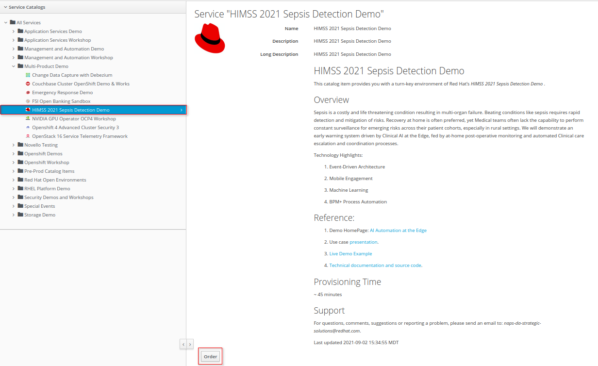

. Read through the overview and click _Order_ at the bottom of the page.
. Fill in the details in the _Lab Information_ tab
+
NOTE:  Among the ordering options, there are several OpenShift cluster sizes to choose from.  A size of _Training_ is sufficient to support the demo.

. Click: _Submit_.

. Expect to receive an intial two emails providing process within the first 20 minutes of ordering.
+
[blue]#While waiting, one suggestion might be to skim through the following 3 sections of this doc: _Demo Components_, _Demo Scenario_ and _Architecture_# ,
. Expect a third email about another 40 minutes after the second email.
+
The base OpenShift environment is now provisioned.
+

This third email will provide details regarding this OpenShift environment that the demo will run on.
+
Log into the OpenShift Console using the details provided in the email.

. After the third email arrives, wait about another 30 minutes for the HIMSS demo itself to fully provision on the base OpenShift.

.. If you've logged into the new OpenShift environment at the command line, you can monitor demo installation progress by executing the following:
+
-----
$ oc logs -f -c manager $( oc get pod -n ansible-system | grep "^ansible" | awk '{print $1}' ) -n ansible-system
----- 

.. Upon successful completion of the HIMSS demo, a log statement should appear similar to the following: 
+
-----
----- Ansible Task Status Event StdOut (cache.redhat.com/v1alpha1, Kind=HIMSS2021, himss2021-sample/ansible-system) -----

PLAY RECAP *********************************************************************
localhost                  : ok=233  changed=74   unreachable=0    failed=0    skipped=42   rescued=0    ignored=0   

----------

-----

. The following are OpenShift namespaces with functionality that supports the demo:
+
-----
$  oc get project | grep 'knative\|sepsis'

knative-eventing
knative-serving
knative-serving-ingress
sepsisdetection-sso
user1-sepsisdetection
-----

== Demo Scenario

The demo scenario involves 3 different users each with different roles.

An _Administrator_ starts a business process.
A _doctor_ reviews the state of the business process and administers any tasks assigned to she/he .
A _provider_ then administers any tasks assigned to she/he .

=== Reset Demo

. In the Openshift console, navigate to the _routes_ in the _user1-sepsisdetection_ namespace
+
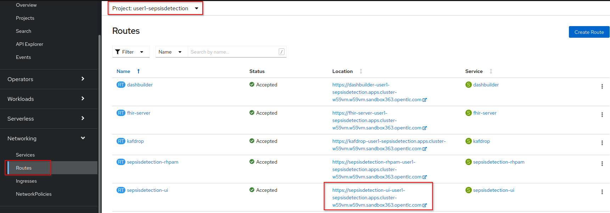

.. Click the URL of the _sepsisdetection-ui_ route.
+
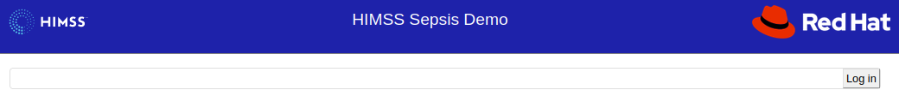

. Authenticate in using credentials of:   _pamAdmin / pam_

. Click the _Reset Demo_ button: 
+
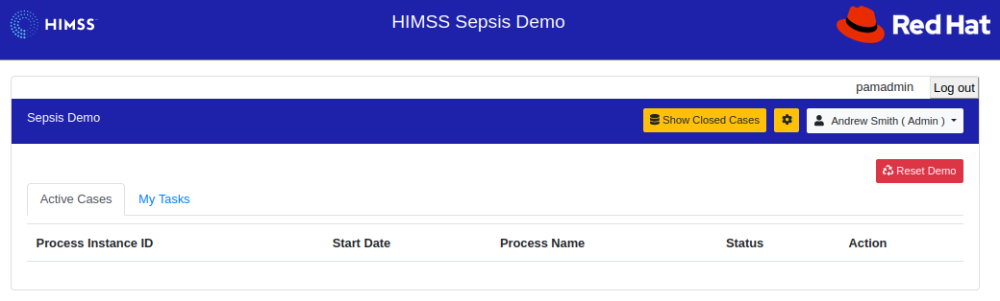

. After a few seconds, there should be an active business process:
+
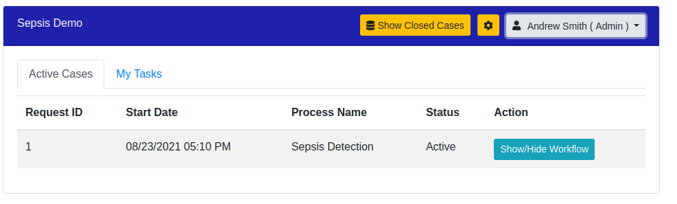

. Click the _Log out_ button at the top right corner to log out as an Administrator.

=== Doctors:   Administer Tasks

. Log back into the Sepsis Detection UI as a _doctor_.
+
Use credentials of:   _eve / pam_.

. Click `Show/Hide Workflow`:
+
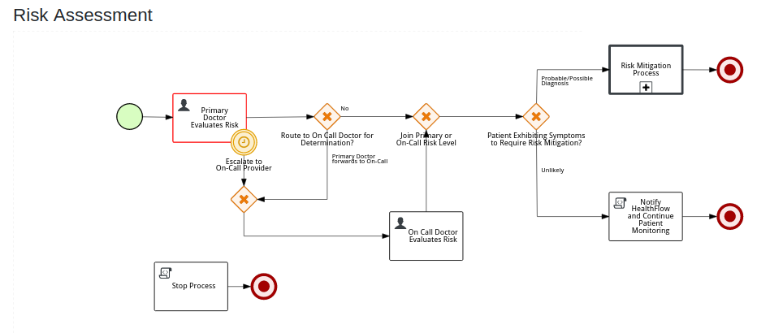
+
Notice the timer on the _Primary Doctor Evaluates Risk_ task.
For the purpose of the demo, this timer is set to 1 minute.
If not administered within 1 minute of creation, the workflow will automatically route to the _On Call Doctor Evaluates Risk_ task.

. Click the `My Tasks` tab: 
+
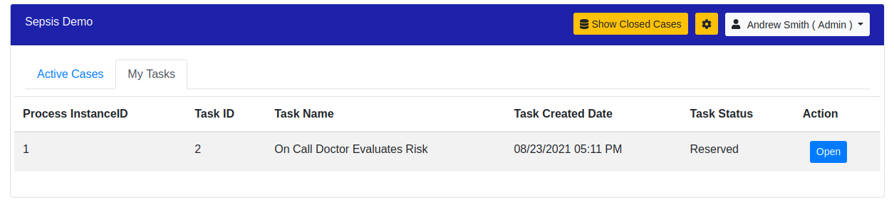

. On any of the tasks, click the _Open_ button and decide on an appropriate course of action.
+
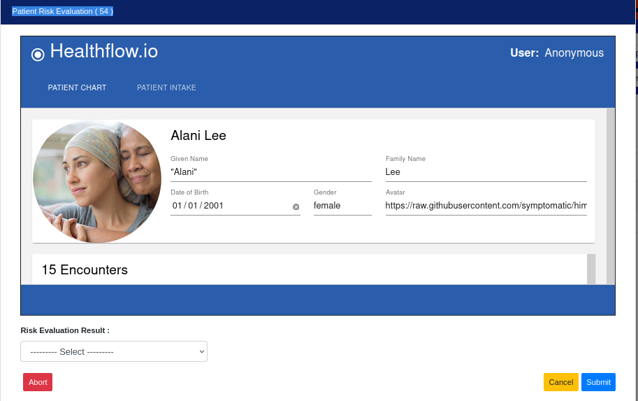

.. Select one of the options from the _Risk Evaluation Result_ drop-down.
.. Click _Submit_.

. Click the _Log out_ button at the top right corner to log out as a _doctor_.

=== Providers:  Administer Tasks

. Log back into the Sepsis Detection UI as a _provider_.
+
Use credentials of:   _bob / pam_.

. Similar to what you already did as a simualated _doctor_, manage the lifecycle of any tasks assigned to a _provider_.

== Demo Components

The purpose of this section is to highlight the major components of the demo.

=== Red Hat SSO

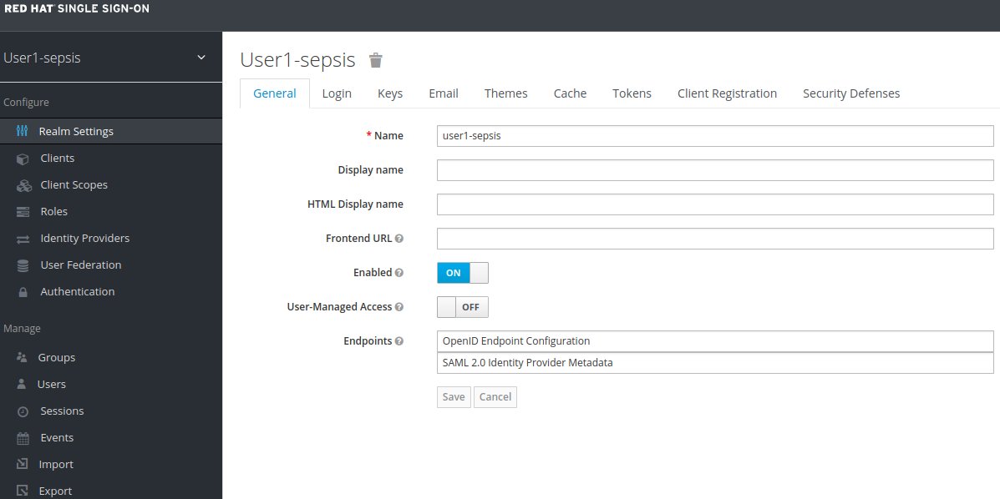

Red Hat SSO is used as the OpenID Connect provider of access tokens needed by other demo components for authentication and authorization.

For the purpose of the demo, the RH-SSO consists a single SSO _realm_ configured with an SSO client and multiple users and roles to facilitate the use case.

=== Hapi FHIR Server

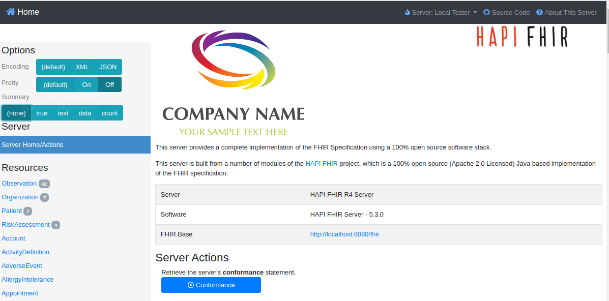

The demo consists of a link:https://hapifhir.io/hapi-fhir/docs/server_jpa/[HAPI FHIR JPA server] .

This server maintains the state of all link:https://www.hl7.org/fhir/resourcelist.html[FHIR resources] involved in the _sepsis detection_ use case.

The HAPI FHIR server is backed by a PostgreSQL database.

=== AMQ Streams / Debezium / Kafdrop

The architecture of the demo is primarily _event driven_.

As such, the demo makes use of Red Hat's AMQ Streams and Debezium technologies.

For monitoring of kafka topcs in AMQ Streams, the demo provides an instance of link:https://github.com/obsidiandynamics/kafdrop[Kafdrop]

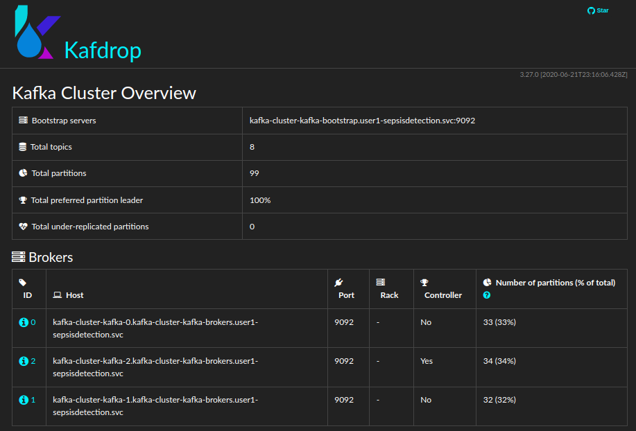

Kafdrop allows for instrospection of messages in the kafka topics.

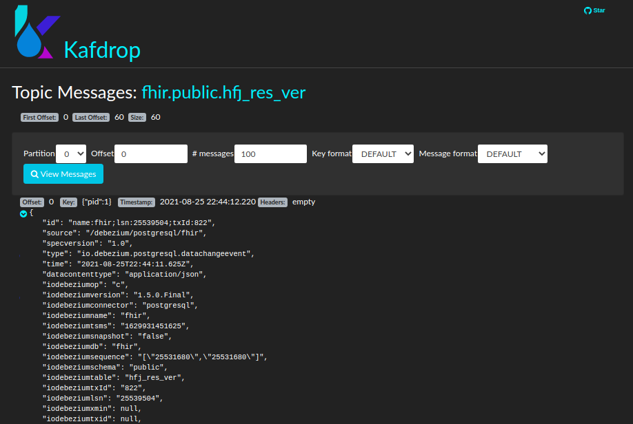

=== Sepsisdetection-rhpam

This service consists of the RH-PAM _process_engine_ embedded in SpringBoot.

.. This service consumes messages from Red Hat AMQ Streams
+
In particular, it consumes _change events_ from the PostgreSQL database of the HAPI FHIR server.
+
ie: When a new FHIR _Patient_ resource is posted to the HAPI FHIR REST API, a record is added to the HAPI FHIR PostgreSQL database.
Subsequently, a _change event_ that captures this database record is sent to an AMQ Streams/Kafka topic.

.. This service also exposes the following RESTful APIs:
... Standard RH-PAM KIE-Server REST APIs
+
image::docs/images/swagger-ui.png[]

... FHIR Enabled REST APIs:
+
Augments the RH-PAM KIE-Server with additional APIs that allow for handling FHIR related process and task variables

=== Dashbuilder

For monitoring of business processes and user tasks the demo provides an instance of RH-PAM's _dashbuilder_ technology.

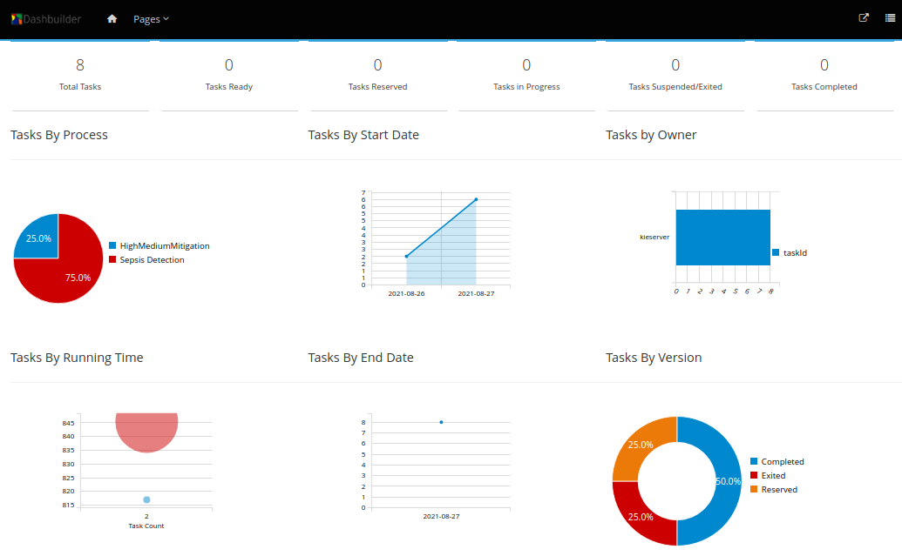

=== Sepsisdetection-UI

The demo provides a user interface written in AngularJS .

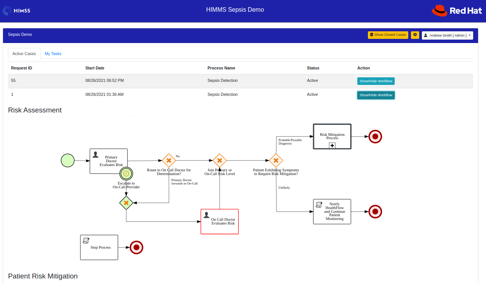

This UI allows _role-based-access-control_ to various features based on the roles in the SSO _access token_ of an authenticated user.

== Architecture

===  Sepsis Detection Runtime processes:

. _sepsisdetection_ parent process
+
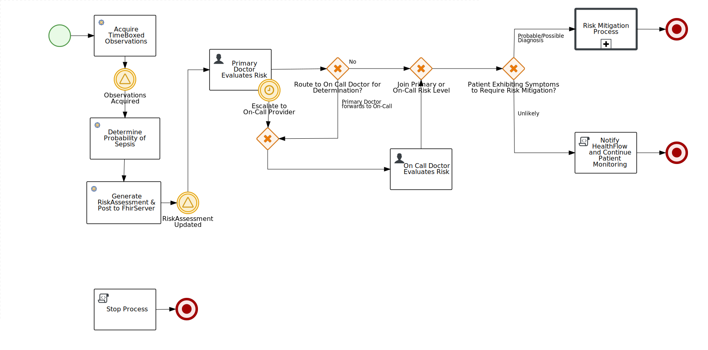

. _highmediummitigation_ Subprocess: 
+
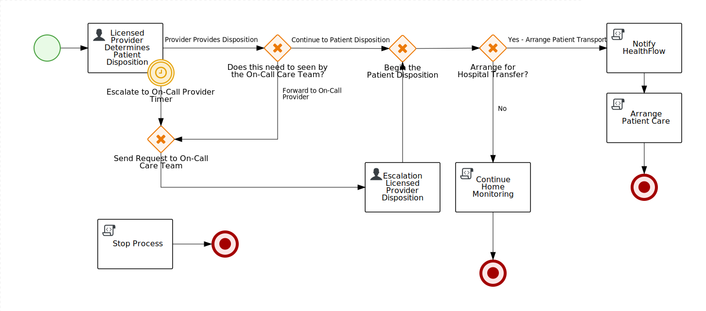

=== Deployment Architecture

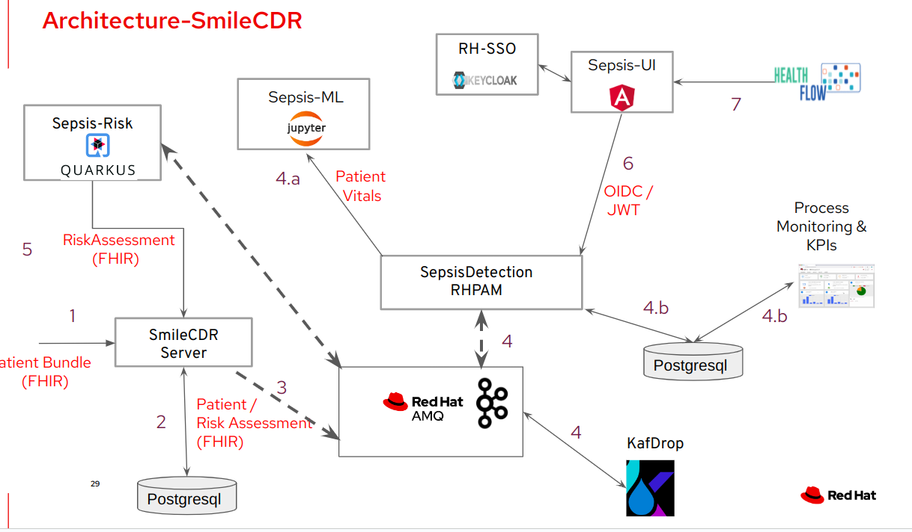

. An external client POSTs a FHIR R4 _bundle_ (with a Patient, Location and multiple Observation resources ) to the RESTful API of the HAPI FHIR JPA server.
. HAPI FHIR JPA Server persists (using Hiberate) to its PostgreSQL database.  FHIR resources are stored as gzip blobs in the following table of the HAPI FHIR database schema:  _public.hfj_res_ver_ .
. Debezium detects the additional records to the _public.hfj_res_ver_ table and puts them in motion by sending the raw GZIP blobs to a kafka topic:  _fhir.public.hfj_res_ver_
. Messages in the _fhir.public.hfj_res_ver_ topic can now be viewed via monitoring tools such as _KafDrop_.  The _sepsisdetection_rhpam_ application is also a consumer on that topic.  With consumption of a Patient resource, the RH-PAM _process-engine_ embedded in the _sepsisdetection-RHPAM_ application is invoked and a _sepsis-detection_ business process is started.
+
These business process and corresponding human tasks can be monitored via tools such as RH-PAMs _dashbuilder_ component.

.. As part of the _sepsis-detection_ business process, the RESTful API of the HAPI FHIR server is queried for a list of all _Observation_ resources for the Patient in a given time period and a _PatientVitals_ resource is created.

.. As part of the _sepsis-detection_ business process, the _PatientVitals_ resource is used as the payload of an HTTP POST request to the _sepsisdetection-ml_ function.  The function responds with an indication of whether sepsis is likely or not.

.. As part of the _sepsis-detection_ business process, a _generateRiskAssessmentCommand_ message is sent (as a _Cloud Event) to RHT AMQ Streams.

. The _SepsisDetection-Risk_ service consumes the _generateRiskAssessmentCommand_ Cloud Event.  A FHIR R4 _RiskAssessment_ resource (which includes the data indicating likelyhood of sepsis) is posted to the FHIR Server via its RESTful APIs.
+
Debezium detects the addition of the _Risk Assessment_ resource in the HAPI FHIR database and forwards this event as message to Red Hat AMQ Streams.
+
RH-PAM picks up this change event with the Risk Assessment resource and advances the business process to the next task.

. A user with a set of roles (defined in RH-SSO) authenticates into the _SepsisDetection-UI_.  The _sepsisdetection-ui_ interacts with RH-SSO (as per the _Authorization Code Flow_ protocol of OIDC) to generate an _Access Token_.  The _sepsisdetection-ui_ interacts with the RESTful _KIE-Server_ APIs (and includes the _access token_ in the request) of _sepsisdetection-rhpam_ and renders a user interface that allows for management of the _sepsis-detection_ business process and corresponding human tasks.  Depending on the role of the authenticated user, that user is presented with _user tasks_ with which to work through their lifecycle.

. The _sepsisdetection-ui_ pulls in an IFrame from HealthFlow.

== Deploy to OpenShift using Ansible

Ansible is included to deploy this application to OpenShift in a repeatable manner.

[red]#This section is only relevant if the desire is to provision the demo on your own OpenShift environemnt and not order the demo from RHPDS# .

=== Pre-reqs:

. *OpenShift Container Platform*
+
Sepsis dection demo has been tested on the following versions of OCP:

.. 4.9.0
.. 4.10.3

. *Resource requirements*
+
Resource requirements as needed by the app (doesn’t include resource requirements of Openshift to support itself) is as follows:

.. RAM: 6 GB

.. CPU: 8

.. Storage: 10 PVCs of type RWO (no RWX requirement) and each of size 5 GiB

. *cluster-admin credentials* to this OpenShift cluster are needed

. *wildcard certificate for routes*
+
Out-of-the-box install of OCP typically includes self-signed certs to secure the cluster's routes.  It is highly recommended that a wildcard cert issued by a well-known certificate authority (ie:  LetsEncrypt) be applied to the cluster.  If not, the sepsisdetection demo will successfully provision but the sepsisdetection-ui (as rendered in your browser) will not function correctly.  In particular, CORS settings typically break when the various routes that your browser will need access to are secured using a self-signed cert.

. *oc utility* (of version correspsonding to OCP cluster) installed locally
+
All versions of this utility are available at either of the following:

.. https://access.redhat.com/downloads/content/290
+
RHN subscription required

.. https://mirror.openshift.com/pub/openshift-v4/clients/ocp/?C=M;O=D
+
Accessible without a RHN subscription

. *ansible* installed locally
+
ie: dnf install ansible

.. Ensure the `kubernetes.core` ansible galaxy collection is installed locally:
+
-----
$ ansible-galaxy collection install kubernetes.core
-----

. *git* installed locally

=== Procedure:

. Using the oc utility that corresponds to the version of OpenShift that you will deploy to, log into the cluster:
+
-----
$ oc login <OCP API Server url> -u <cluster-admin userId> -p <passwd>
-----

. Clone the source code of this project:
+
-----
$ git clone https://github.com/redhat-naps-da/himss_2021_sepsis_detection
-----

. Change to the ansible directory of this project:
+
-----
$ cd ansible
-----

. Deploy to OpenShift:
+
NOTE: If you are running the install from a Mac, it will be necessary to manually create the user1-sepsisdetection namespace prior to the step below.
+
-----
$ ansible-playbook playbooks/install.yml
-----

.. Deployment should complete in about 15 minutes.

.. Notice the creation of a new OCP namespace where the application resides: _user1-sepsisdetection_

.. At the completion of the installation, expect to see messages similar to the following:
+
-----
PLAY RECAP *******************************************************************************************************************************************************************************************************
    localhost                  :  ok=137  changed=77   unreachable=0    failed=0    skipped=14   rescued=0    ignored=0

-----

. Optional: Uninstall from OpenShift:
+
-----
$ ansible-playbook playbooks/uninstall.yml
-----

== Local containerized environment

This project includes a _docker-compose_ config file that allows for deployment of the application as containers in your local environment.

[red]#This section is only relevant to developers of the demo#

. Start application pod with all linux containers:
+
-----
$ docker-compose -f etc/docker-compose.yaml up -d
-----
+
NOTE:  If underlying linux container system in use in your local environment is podman, then follow this link:https://fedoramagazine.org/use-docker-compose-with-podman-to-orchestrate-containers-on-fedora/[set-up guide].

. The following diagram depicts the containers instantiated as part of this pod:  
+
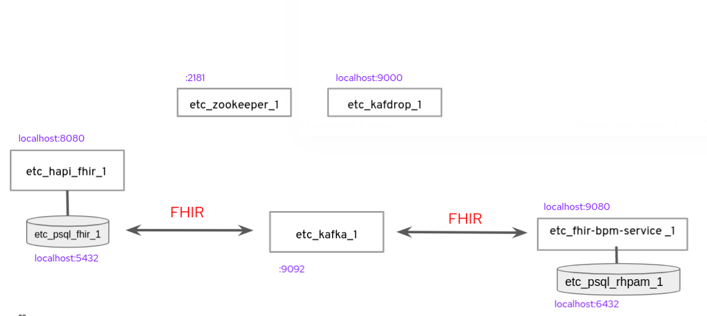

. Post Debezium configs to kafka_connect container:
+
-----
$ curl -X POST \
        -H "Accept:application/json" -H "Content-Type:application/json" \
        localhost:8083/connectors/ \
        -d "@etc/hapi-fhir/debezium-fhir-server-pgsql.json"
-----
+
NOTE:  This step is not needed when running the solution in OpenShift.  It's only needed when running the solution in a local containerized environmennt (ie:  docker-compose)

. Stop application pod with all linux containers:
+
-----
$ docker-compose -f etc/docker-compose.yaml down
-----

== Test

[red]#This section is only relevant to developers of the demo#

=== Environment Variables

Set the following environment variables with values similar to the following:

. If testing locally deployed application (via docker-compose):
+
-----
export RHSSO_HOST=sso.local
export RHSSO_URL=http://$RHSSO_HOST:4080
export RHSSO_MASTER_PASSWD=admin
export REALM_ID=kieRealm
export retrieve_token_url="$RHSSO_URL/realms/$REALM_ID/protocol/openid-connect/token"
export SEPSISDETECTION_RHPAM_URL=http://localhost:9080
export FHIR_SERVER_URL=http://localhost:8080
-----

. Add the following entry to your `/etc/hosts`:
+
-----
127.0.0.1   sso.local
-----

. If testing environment deployed to OpenShift:
+
-----
SEPSISDETECTION_RHPAM_URL=https://$(oc get route sepsisdetection-rhpam -n user1-sepsisdetection --template='{{ .spec.host }}')
RHSSO_URL=https://$(oc get route sso -n sepsisdetection-sso --template='{{ .spec.host }}')/auth
REALM_ID=user1-sepsis
retrieve_token_url="$RHSSO_URL/realms/$REALM_ID/protocol/openid-connect/token"
FHIR_SERVER_URL=https://$(oc get route fhir-server -n user1-sepsisdetection --template='{{ .spec.host }}')
-----

=== RH-SSO

==== *Master* Realm

You can also login directly to the custom SSO realm used in the demo.  Details as follows: 

.. *userId* : admin
.. *password* : execute the following from the command line:
+
-----
$ echo -en "\n$(
     oc get secret credential-rhsso -o json -n sepsisdetection-sso \
     | jq .data.ADMIN_PASSWORD \
     | sed 's/"//g' \
     | base64 -d
  )\n"
-----

.. *url:*
+
Using the credentials listed above, log into the _master_ realm of the RH-SSO server at the following URL: 
+
-----
$ echo -en "\n$RHSSO_URL\n"
-----

==== Sepsis Detection SSO Realm

. You can also login directly to the custom SSO realm used in the demo.  Details as follows: 

.. *URL*
+
-----
$ echo -en "\n$RHSSO_URL/auth/admin/$REALM_ID/console\n"
-----

.. *userId* :  ssoRealmAdmin
.. *password* : pam

=== HAPI FHIR Server

The application includes a HAPI FHIR Server that exposes RESTful endpoints.

. Test HAPI FHIR Server CORS headers using a _preflight_ request:
+
-----
$ curl -i -X OPTIONS -H "Origin: http://localhost:7080" \
    -H 'Access-Control-Request-Method: POST' \
    -H 'Access-Control-Request-Headers: Content-Type, Authorization' \
    "http://localhost:8080/fhir"

HTTP/1.1 200 
Vary: Origin
Vary: Access-Control-Request-Method
Vary: Access-Control-Request-Headers
Access-Control-Allow-Origin: *
Access-Control-Allow-Methods: GET,POST,PUT,DELETE,OPTIONS,PATCH,HEAD
Access-Control-Allow-Headers: Content-Type, Authorization
Access-Control-Expose-Headers: Location, Content-Location
-----

. POST Demo Observation to FHIR server
+
-----
$ curl -X POST \
       -H "Content-Type:application/fhir+json" \
       $FHIR_SERVER_URL/fhir \
       -d "@sepsisdetection-rhpam/src/test/resources/fhir/DemoBundle.json"
-----

. POST Demo RiskAssessment to FHIR server
+
-----
$ curl -X POST \
       -H "Content-Type:application/fhir+json" \
       $FHIR_SERVER_URL/fhir/RiskAssessment \
       -d "@sepsisdetection-risk/src/test/resources/fhir/RiskAssessment.json"
-----

=== SepsisDetection RHPAM

The sepsisdetection-rhpam deployment is enabled with the _kie_server_ as well as various endpoints that can consume FHIR payloads.

. Retrieve an OAuth2 token using the `sepsisdetection` SSO client of the pre-configured SSO realm:
+
-----
TKN=$(curl -X POST "$retrieve_token_url" \
            -H "Content-Type: application/x-www-form-urlencoded" \
            -d "username=pamAdmin" \
            -d "password=pam" \
            -d "grant_type=password" \
            -d "client_id=sepsisdetection" \
            | sed 's/.*access_token":"//g' | sed 's/".*//g')

echo $TKN
-----

. By setting _fullScopeAllowed=true_ in SSO client, all roles assocated with an authenticated user will be included in the access token.
+
These roles can be visualized as follows:
+
-----
$ jq -R 'split(".") | .[1] | @base64d | fromjson' <<< $TKN | jq .realm_access.roles

[
  "interviewer",
  "kie-server",
  "user"
]
-----

. Health Check Report
+
-----
$ curl -H "Authorization: Bearer $TKN" \
       -H 'Accept:application/json' \
       $SEPSISDETECTION_RHPAM_URL/rest/server/healthcheck?report=true
-----

. View raw swagger json
+
-----
$ curl -H "Authorization: Bearer $TKN" $SEPSISDETECTION_RHPAM_URL/rest/swagger.json | jq .
-----

. View swagger-ui:
+
Point your browser to the output of the following:
+
-----
$ echo -en "\n$SEPSISDETECTION_RHPAM_URL/rest/api-docs/?url=$SEPSISDETECTION_RHPAM_URL/rest/swagger.json\n"
-----
+
image::docs/images/swagger-ui.png[]

. List KIE Containers
+
-----
$ curl -H "Authorization: Bearer $TKN" \
       -X GET $SEPSISDETECTION_RHPAM_URL/rest/server/containers
-----

. List process definitions in JSON representation:
+
-----
$ curl -H "Authorization: Bearer $TKN" \
       -X GET -H 'Accept:application/json' \
       $SEPSISDETECTION_RHPAM_URL/rest/server/containers/sepsisdetection-kjar/processes/
-----

. List process instances for a deployment in JSON representation:
+
-----
$ curl -H "Authorization: Bearer $TKN" \
       -X GET -H 'Accept:application/json' \
       $SEPSISDETECTION_RHPAM_URL/rest/server/queries/containers/sepsisdetection-kjar-1.0.0/process/instances
-----

. Identify active node of process instance:
+
-----
$ curl -H "Authorization: Bearer $TKN" \
       -X GET -H 'Accept:application/json' \
       $SEPSISDETECTION_RHPAM_URL/rest/server/containers/sepsisdetection-kjar-1.0.0/processesses/instances/${pInstanceId}/nodes/instances | jq .[][0]
-----

. List user tasks given a list of roles in access token:
+
-----
$ curl -H "Authorization: Bearer $TKN" \
       -X GET -H 'Accept:application/json' \
       $SEPSISDETECTION_RHPAM_URL/rest/server/queries/tasks/instances/pot-owners | jq .
-----

. List user tasks as a Business Admin:
+
-----
$ curl -H "Authorization: Bearer $TKN" \
       -X GET -H 'Accept:application/json' \
       $SEPSISDETECTION_RHPAM_URL/rest/server/queries/tasks/instances/admins | jq .
-----

. List cases in JSON representation:
+
-----
$ curl -H "Authorization: Bearer $TKN" \
       -X GET -H 'Accept:application/json' \
       $SEPSISDETECTION_RHPAM_URL/rest/server/queries/cases/
-----

== Additional Development Notes

=== HAPI FHIR Server Development & Customizations

. Start HAPI FHIR server in debug mode:
+
-----
$ JAVA_OPTS="$JAVA_OPTS -agentlib:jdwp=transport=dt_socket,address=*:5005,server=y,suspend=n"
$ mvn clean package -DskipTests -Pboot
$ java -DJAVA_OPTS=$JAVA_OPTS -jar target/ROOT.war
-----

. View _bytea_ type in _res_text_ field of _public.hfj_res_ver_ table:
+
-----
fhir=# \d hfj_res_ver
                          Table "public.hfj_res_ver"
     Column     |            Type             | Collation | Nullable | Default 
----------------+-----------------------------+-----------+----------+---------
 pid            | bigint                      |           | not null | 
 partition_date | date                        |           |          | 
 partition_id   | integer                     |           |          | 
 res_deleted_at | timestamp without time zone |           |          | 
 res_version    | character varying(7)        |           |          | 
 has_tags       | boolean                     |           | not null | 
 res_published  | timestamp without time zone |           | not null | 
 res_updated    | timestamp without time zone |           | not null | 
 res_encoding   | character varying(5)        |           | not null | 
 res_text       | bytea                       |           |          | 
 res_id         | bigint                      |           | not null | 
 res_type       | character varying(40)       |           | not null | 
 res_ver        | bigint                      |           | not null |
-----

=== sepsisdetection-rhpam

. Build and install _kjar_ project:
+
-----
$ cd sepsisdetection-kjar

$ mvn clean install -DskipTests
-----

. Build KIE-Server executable from this project:
+
-----
$ cd sepsisdetection-rhpam

$ mvn clean package
-----

. Build and Start app
+
-----
$ mvn clean package -DskipTests && \
         java -Dorg.kie.server.repo=../etc/sepsisdetection-rhpam/runtime_configs \
              -jar target/sepsisdetection-rhpam-0.0.1.jar &> /tmp/sepsisdetection-rhpam.log &
-----

. Optional:  Create a _kie-container_ in kie-server  (kie-container should already be registered as per contents of etc/rhpam/sepsisdetection-rhpam.xml )
+
-----
$ export KJAR_VERSION=1.0.0
$ export KIE_SERVER_CONTAINER_NAME=sepsisdetection-rhpam

$ sed "s/{KIE_SERVER_CONTAINER_NAME}/$KIE_SERVER_CONTAINER_NAME/g" etc/rhpam/kie_container.json \
     | sed "s/{KJAR_VERSION}/$KJAR_VERSION/g" \
     > /tmp/kie_container.json && \
     curl -u "kieserver:kieserver" -X PUT -H 'Content-type:application/json' localhost:9080/rest/server/containers/$KIE_SERVER_CONTAINER_NAME-$KJAR_VERSION -d '@/tmp/kie_container.json'
-----

== Additional References

. link:https://www.redhat.com/en/resources/earlier-sepsis-detection[Sepsis Detection Brief]
. link:https://docs.google.com/presentation/d/1pyKctkvtpjuav52P-qg6SBKDmbaCP_GO/edit#slide=id.p1[AI Automation at the Edge, HIMSS 2021]
. link:https://trello.com/c/fbnRjpZu/22-detection-of-pneumonia-from-chest-x-rays[Trello Card]
. link:https://docs.google.com/presentation/d/1nLNPzu93bhOW_QNZDiBxERgYVMJ9RBV1ZhtMJECr5s0/edit#slide=id.g775d9c5cf4_0_717[Technical Presentation]
. link:https://lucid.app/lucidchart/44b1e8b0-2a68-45ac-82b5-9428178071ae/edit?shared=true&page=0_0#[Lucid Chart:  HIMSS Demo Logical Architecture]
. link:https://access.redhat.com/documentation/en-us/red_hat_decision_manager/7.11/html-single/integrating_red_hat_decision_manager_with_other_products_and_components/index#assembly-springboot-business-apps[RH-PAM apps with SpringBoot]

=== Original Repos
. https://github.com/redhat-naps-da/sepsis-detection
. https://gitlab.consulting.redhat.com/ba-nacomm/sepsis-detection/sepsisdetection-service/-/tree/master/openshift
. https://gitlab.consulting.redhat.com/ba-nacomm/sepsis-detection/sepsisdetection-kjar
. https://gitlab.consulting.redhat.com/ba-nacomm/sepsis-detection/sepsis-ui

== Bug list

. Decide what to do about integrating with Healthflow.io .
Maybe create a simulator
+
HealthFlow was initially supposed to have been deployed on the kubeframe as part of the demo, but they couldn't get it containerized in time, so it was relegated to being displayed in that iFrame. 
There's a container image out there for it, but it's monolithic and bulky, and we kind of shelved helping them with it for the time being. 
It's based on a project called Meteor, and includes an embedded FHIR server with database instance, as well as some other stuff. Pretty heavy duty.
+
Example URL: 
+
https://my.healthflow.io/patient-chart?patientId=610f11c05b041e00082c54c2

. Persisting list of Observations as part of process instance variables caused problems when retrieving those pInstance variables and marshalling to json (so as to be rendered in sepsisdetection-ui ).

. KnativeEventing
+
Knative Eventing is not currently used.
However, if it was used, there seems to be a problem with starting multiple KnativeKafka installs in the default knative-eventing namespace when deploying in a shared cluster.

== Operator notes

=== Reference
. link:https://sdk.operatorframework.io/docs/building-operators/ansible/tutorial/[ansible operator tutorial]

. link:https://quay.io/repository/redhat_naps_da/sepsisdetection-operator?tab=tags[HIMSS 2021 Sepsis Detection Operator Image Tags]

=== Monitoring

The HIMSS Demo operator can be monitored by tailing its log file as follows:

-----
$ oc logs -f -c manager $( oc get pod -n ansible-system | grep "^ansible" | awk '{print $1}' ) -n ansible-system
-----

=== Development

==== Base Operator

NOTE:  HIMSS 2021 demo is available via RHPDS.  For the purpose of updating the HIMSS 2021 operator (which is invoked when ordering the demo from RHPDS), execution of the steps in this section is all that is needed.

. At the root of the `ansible` directory of this project, modify the Makefile (as needed)
+
Most likely, all you'll need to do is increment the `VERSION`.

. Ensure you have permissions to push images to push link:https://quay.io/repository/redhat_naps_da/sepsisdetection-operator?tab=tags[HIMSS 2021 Sepsis Detection Operator Image Repo].

. Using the `podman` utility, log into `quay.io`.

. Build image and deploy to quay:
+
-----
$ make docker-build docker-push
-----

. Change _latest_ tag in quay:
+
In order for the updated sepsisdetection-operator image to be picked up in RHPDS, you'll need to change the _latest_ tag in quay.io.

.. In your browser, navigate to https://quay.io/repository/redhat_naps_da/sepsisdetection-operator?tab=tags
.. Log into quay.io as admin of the `redhat_naps_da` organization.
.. Modify the _latest_ tag such that it is linked with the latest image that was previously pushed.
+
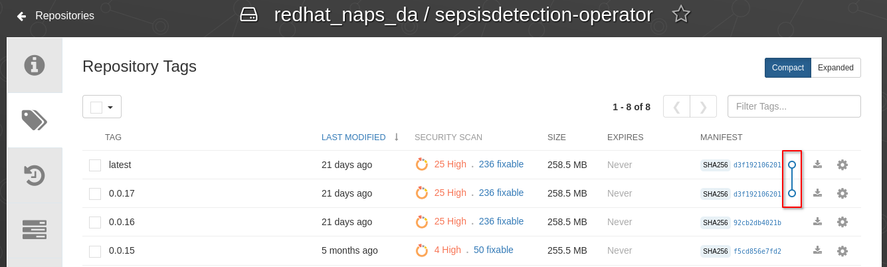

==== Optional: Deploy operator to your own OCP cluster

. Deploy operator in OpenShift cluster:
+
-----
$ make deploy

cd config/manager && /u01/labs/mw/redhat-naps-da/himss_interoperability_showcase_2021/ansible/bin/kustomize edit set image controller=quay.io/redhat_naps_da/sepsisdetection-operator:0.0.2
/u01/labs/mw/redhat-naps-da/himss_interoperability_showcase_2021/ansible/bin/kustomize build config/default | kubectl apply -f -
I0831 13:00:25.259384   30895 request.go:668] Waited for 1.075752563s due to client-side throttling, not priority and fairness, request: GET:https://api.cluster-3983.3983.sandbox362.opentlc.com:6443/apis/security.internal.openshift.io/v1?timeout=32s
namespace/ansible-system created
customresourcedefinition.apiextensions.k8s.io/himss2021s.cache.redhat.com created
serviceaccount/ansible-controller-manager created
role.rbac.authorization.k8s.io/ansible-leader-election-role created
clusterrole.rbac.authorization.k8s.io/ansible-manager-role created
clusterrole.rbac.authorization.k8s.io/ansible-metrics-reader created
clusterrole.rbac.authorization.k8s.io/ansible-proxy-role created
rolebinding.rbac.authorization.k8s.io/ansible-leader-election-rolebinding created
clusterrolebinding.rbac.authorization.k8s.io/ansible-manager-rolebinding created
clusterrolebinding.rbac.authorization.k8s.io/ansible-proxy-rolebinding created
configmap/ansible-manager-config created
service/ansible-controller-manager-metrics-service created
deployment.apps/ansible-controller-manager created
-----

. Install HIMSS2021 resource
+
-----
$ oc apply -f config/samples/cache_v1alpha1_himss2021.yaml -n ansible-system
-----

. Acquire needed configs for use in RHPDS:
+
-----
$ mkdir rhpds
$ bin/kustomize build config/default > rhpds/sepsisdetection-operator-all-configs.yml
$ cp config/samples/cache_v1alpha1_himss2021.yaml rhpds
-----

==== OLM

. list status of existing OLM on RHPDS cluster
+
-----
$  operator-sdk olm status --olm-namespace openshift-operator-lifecycle-manager
-----

. uninstall existing OLM on RHPDS cluster
+
-----
$  operator-sdk olm uninstall --version 0.17.0
-----

. install _latest_ OLM in olm namespace
+
-----
$ operator-sdk olm install
-----

=== RHPDS Related Activities

. link:https://redhat.service-now.com/surl.do?n=RITM0979812[Demo Onboarding request] into RHPDS

. agnosticd link:https://github.com/redhat-cop/agnosticd/pull/4071[pull request]

