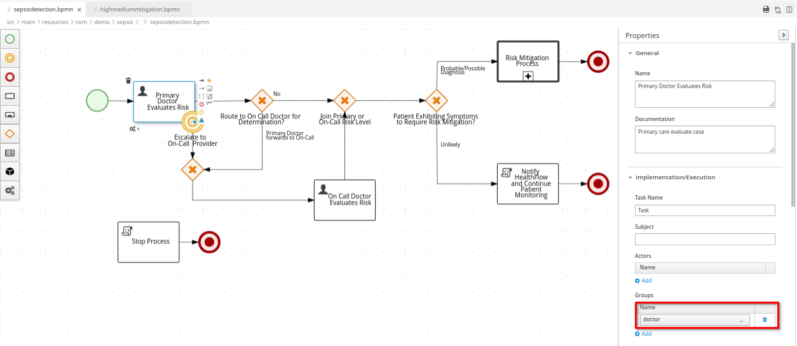
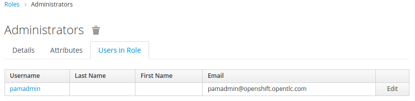
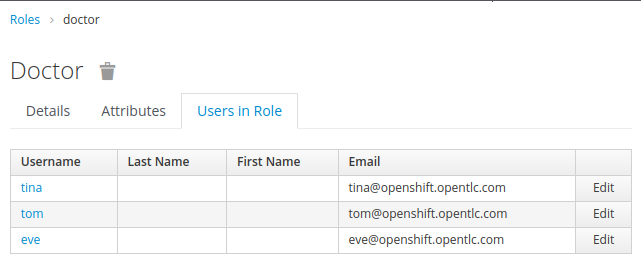
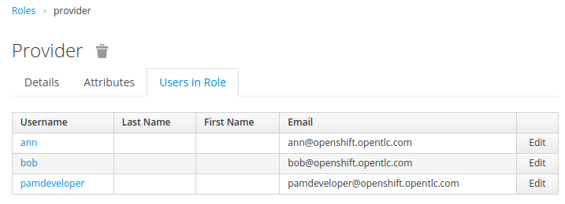
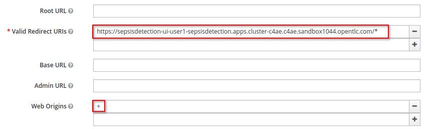
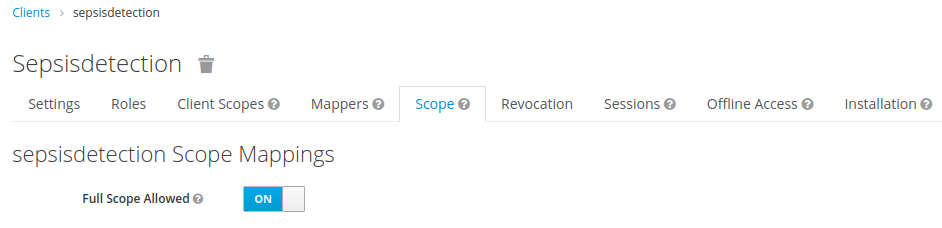

:scrollbar:
:data-uri:
:toc2:
:linkattrs:

= Basic OIDC & CORS Enabled Workflow Apps

:numbered:

== Overview

The link:https://github.com/redhat-naps-da/himss_interoperability_showcase_2021/blob/master/README.adoc[HIMSS Sepsis Detection demo] leverages the OpenID Connect (OIDC) protocol to secure the user interface and workflow engine of the demo.

The purpose of this tutorial is to deep-dive into the configurations that enable _the basic_ setup of OIDC and CORS found in the Sepsis Detection demo.  In particular, the learning objectives are as follows:

. Understand which roles to assign to which users and why in a Workflow application.

. Understand the relevance of the _Full Scope Allowed_ config in an SSO client to a BPM workflow application.

. Understand the relevance of a _UserGroupCallback_ implementation in RH-PAM.

. Understand where and how to enable CORS when using RH-SSO and RH-PAM.

[red]#This tutorial does not provide exhaustive documentation on all things RH-PAM, OIDC, RH-SSO and SpringBoot.#

The target audience of this tutorial are technical SAs, consultants and developers who need to make use of RH-PAM (on Springboot) and RH-SSO.

== Pre-Reqs

=== Demo
The HIMSS Sepsis Detection demo can be ordered from the _Red Hat Product Demo System (RHPDS)_ as documented in section 3 of the demo link:https://github.com/redhat-naps-da/himss_interoperability_showcase_2021#deploy-to-openshift[README].

=== Client utilities

. `oc` utility (whose version matches that of the OpenShift where the Sepsis Detection Demo is installed on)
+
All versions of this utility are available at either of the following:

.. https://access.redhat.com/downloads/content/290
+
RHN subscription required
.. https://mirror.openshift.com/pub/openshift-v4/clients/ocp/?C=M;O=D
+
Accessible without a RHN subscription

. `link:https://stedolan.github.io/jq/download/[jq]`
. `curl`
. `link:https://github.com/kiegroup/kogito-tooling/releases[Kogito plugin]` for Chrome / Brave browsers (as documented link:https://developers.redhat.com/blog/2019/11/25/kogito-tooling-for-friendly-dmn-and-bpmn-visualization-on-github/[here]).

=== Environment Variables
This tutorial will highlight code and configs found in the demo.
It will also provide commands for you to execute from the command line.

To facilitate the commands listed in this tutorial, please execute the following to set variables in your local environment:

. Log into the openshift cluster that the Sepsis Detection demo is installed on as `cluster-admin` credentials.
. Execute the following as-is:
+
-----
SEPSISDETECTION_RHPAM_URL=https://$(oc get route sepsisdetection-rhpam -n user1-sepsisdetection --template='{{ .spec.host }}')
RHSSO_URL=https://$(oc get route sso -n sepsisdetection-sso --template='{{ .spec.host }}')
REALM_ID=user1-sepsis
retrieve_token_url="$RHSSO_URL/auth/realms/$REALM_ID/protocol/openid-connect/token"
FHIR_SERVER_URL=http://$(oc get route fhir-server -n user1-sepsisdetection --template='{{ .spec.host }}')
-----

== Sepsis Detection Workflow Roles

The BPMN workflows utilized in the Sepsis Detection demo assign User Tasks to _potential owners_.
This section of the tutorial reviews these task related _potential owners_.

. Using your Kogito plugin enabled Chrome or Brave browser, navigate to the link:https://github.com/redhat-naps-da/himss_interoperability_showcase_2021/blob/master/sepsisdetection-kjar/src/main/resources/com/demo/sepsis/sepsisdetection.bpmn[sepsisdetection.bpmn]

. Click on any of the _User Tasks_ in the business process and notice the assigned _potential owners) at: _Properties -> Implementation / Execution -> Groups_
+

. Notice that some of the user tasks are assigned to potential users with a role of _doctor_.
. Other user tasks are assigned to potential users with a role of _provider_.
. In addition, all user tasks are implicitely assigned by default to users with a role of _Administrators_.  Related, all user tasks are also assigned by default to a user whose name is: _Administrator_.
+
Doing so allows an administrator to view and manage the lifecycle of all user tasks.

The demo also includes a link:https://github.com/redhat-naps-da/himss_interoperability_showcase_2021/blob/master/sepsisdetection-kjar/src/main/resources/com/demo/sepsis/highmediummitigation.bpmn[sub-process] with user tasks.  What _potential owners_ are these tasks assigned to ?

What behavior would you expect from the RH-PAM process engine if an authenticated user whose role is not an admin, _doctor_ or _provider_ attempts to query for user tasks ?

== RH-SSO

You have seen how the User Tasks of the _sepsis detection_ workflow processes are assigned to users with roles of _doctor_, _provider_ and _Administrators_.

In this section, you will review the Identity Provider functionality of the demo that facilitates User Task lifecycle in RH-PAM.

The Identity Provider used in the Sepsis Detection demo is RH-SSO.

=== SSO Realm
Login directly to the custom SSO realm used in the demo.  Details as follows: 

.. *URL* : Execute the following to obtain the URL of the SSO Realm admin UI in RH-SSO:
+
-----
$ echo -en "\n$RHSSO_URL/auth/admin/$REALM_ID/console\n"
-----

.. *userId* :  ssoRealmAdmin
.. *password* : pam
+
image::images/rh-sso.png[]

This SSO _Realm_ defines _SSO Clients_, _mappings_ and _token_ details.  It is also pre-loaded with _users_ and _roles_.

=== User & Roles

The SSO realm comes with users pre-configured with various roles to support the demo use case.  A list of users for each role can be determined as follows:

... *Administrators* role:
+
View the list of _Administrators_ as follows: _user1-sepsis realm -> Configure -> Roles -> _Administrators_ -> Users in Role_
+

+
By default, user task admins in RH-PAM are defined as users with the _Administrators_ role.
+
Users with this role will be able to query and manage the lifecycle of all user tasks in the system at any time.

... *Doctor* role:
+
View the list of _Doctors_ as follows: _user1-sepsis realm -> Configure -> Roles -> _Doctors_ -> Users in Role_
+

... *Provider* role:
+
View the list of _Providers_ as follows: _user1-sepsis realm -> Configure -> Roles -> _Providers_ -> Users in Role_
+

... *kie-server* role:
+
In RH-PAM, the _kie-server_ role does not have anything to do with user task lifecycle management.  Instead, authenticated users with this role are able to invoke the RESTful APIs of the RH-PAM _kie-server_.
+
View the list of _kie-server_ users as follows: _user1-sepsis realm -> Configure -> Roles -> _kie-server_ -> Users in Role_
+
Which users are enabled with a role of _kie-server_ ?  Why would you expect so many users to be enabled with this role ?

=== SSO Client

==== Token Flows
The SSO _client_ used to gain an OIDC _access token_ by other services in the demo (ie:  sepsisdetection-ui ) is called:  _sepsisdetection_.

. Navigate to this client in the RH-SSO admin portal.

. Notice that this sso _client_ allows for acquiring a token via the following _flows_ : 

.. *Authorization Flow Code*
+
Most useful for single page web-app (ie:  such as the _sepsis detection ui_) to acquire an access token.
+
Enabled in the sso _client_ via the _Standard Flow Enabled_ checkbox.

.. *Resource Owner Password Credentials*
+
Most useful for a test client such as the _curl_ utility (as used in this tutorial).
+
Enabled in the sso _client_ via the _Direct Access Grant Enabled_ checkbox.

==== CORS

Notice that the SSO client is pre-configured with a _Valid Redirect URI_ of the Sepsis Detection UI URL.  Doing so enables redirection back to the the Sepsis Detection UI during the OIDC _Authorization Code Flow_ process.

Also, notice that the _Web Origins_ property is set such that all responses back to this Sepsis Detection UI will include CORS headers.  This is required because the RH-SSO Identity Provider is hosted on a different domain than the Sepsis Detection UI.

==== Access Token roles

To support User Task lifecycle management in a workflow application, it is critical that the _roles_ associated with an authenticated user be included in the SSO access token.  You can verify this as follows: 

. In RH-SSO, all roles associated with a user can be included in an _access token_ by enabling _Full Scope Allowed_ on the SSO client.
+
Do so by navigating as follows in the Admin Portal of RH-SSO:
+
user1-sepsis realm -> configure -> clients -> sepsisdetection -> Scope -> Full Scope Allowed .
+

. Test
.. Retrieve an OAuth2 token using the `kie-server` SSO client of the pre-configured SSO realm:
+
-----
TKN=$(curl -X POST "$retrieve_token_url" \
            -H "Content-Type: application/x-www-form-urlencoded" \
            -d "username=tina" \
            -d "password=pam" \
            -d "grant_type=password" \
            -d "client_id=sepsisdetection" \
            | sed 's/.*access_token":"//g' | sed 's/".*//g')

echo $TKN
-----

.. Inspect the roles found in the access token: 
+
-----
$ jq -R 'split(".") | .[1] | @base64d | fromjson' <<< $TKN | jq .realm_access.roles

[
  "doctor",
  "kie-server",
  "user"
]
-----

.. Repeat the above with a different user.  What roles are listed in the access token for the user you used to authenticate ?

.. Disable the _Full Scope Allowed_ config of the SSO client.  What roles are now available in the access token ?
+
NOTE:  Be sure to re-enable this config after done experimenting.

== RH-PAM Process Engine & KIE Server

Security in RH-PAM typically involves AuthN and AuthZ of the _kie-server_ RESTful APIs.  In addition, roles associated with an authenticated user are typically utilized during user task management in a workflow process.

The _sepsisdetection-rhpam_ component of the demo integrates with RH-SSO.

In this section of the tutorial, you review all configs and code related to this integration between RH-PAM and RH-SSO.

=== Keycloak Adapter

A _keycloak adapter_ is loaded at runtime in the SpringBoot based _sepsisdetection-rhpam_ service.  When an external client invokes the _kie-server_ RESTful APIs, the keycloak adapter verifies that that the _bearer_ token included in the request header is valid.

The _keycloak_ adapter is enabled in the SpringBoot service via the following: 

. _org.keycloak:keycloak-spring-boot-starter_ dependency in the _pom.xml_ of the project.
+
In addition to this dependency, also notice the required link:https://github.com/redhat-naps-da/himss_interoperability_showcase_2021/blob/master/sepsisdetection-rhpam/pom.xml#L32-L38[Keycloak Adapter BOM].

. link:https://github.com/redhat-naps-da/himss_interoperability_showcase_2021/blob/master/ansible/resources/sepsisdetection-rhpam/application.properties#L69-L77[keycloak adapter configs] in SpringBoot application.properties.
+
NOTE: Unlike the link:https://www.keycloak.org/docs/latest/securing_apps/#_java_adapter_config[Java Adapter for Keycloak], the keycloak adapter does not appear to support the *enable-cors* property.  Subsequently, CORS needs to be enabled in the *KeycloakWebSecurityConfigurerAdapter* (discussed below).

More details regarding the keycloak adapter for SpringBoot can be found link:https://www.keycloak.org/docs/latest/securing_apps/#_spring_boot_adapter[here].

=== UserGroupCallback

An important aspect of dealing with user tasks is task access control. If you want to execute a task-related action, the user must be eligible to execute that action. For a user to be eligible, the process engine must consider that user to be a _potential owner_ of the task.  The component that plays a vital role in checking task access is the link:https://github.com/kiegroup/droolsjbpm-knowledge/blob/main/kie-api/src/main/java/org/kie/api/task/UserGroupCallback.java[UserGroupCallback interface]. It's a simple interface, and RH-PAM allows you to plug in various (even custom) implementations.

link:https://github.com/kiegroup/droolsjbpm-integration/blob/main/kie-spring-boot/kie-spring-boot-autoconfiguration/jbpm-spring-boot-autoconfiguration/src/main/java/org/jbpm/springboot/security/SpringSecurityUserGroupCallback.java[SpringSecurityUserGroupCallback] is the default UserGroupCallback implementation when the _RH-PAM_ process engine is embedded in SpringBoot.  This UserGroupCallback implementation is able to access the list of roles found in a valid OIDC _access token_.  For most needs when operating in a SpringBoot environment, this UserGroupCallback implementation is sufficient.

However, in the Sepsis Detection demo, this SpringSecurityUserGroupCallback implementation is replaced with the following custom implementation:  _com.redhat.naps.process.KeycloakUserGroupCallback_.  This custom implementation adds the following minor features:

. Allows for restricting (via configuration) the list of potential valid roles that can be specified in a BPMN process (as per the link:https://github.com/redhat-naps-da/himss_interoperability_showcase_2021/blob/master/sepsisdetection-rhpam/src/main/java/com/redhat/naps/process/KeycloakUserGroupCallback.java#L55[existsGroup()] function).

. Increased logging in the link:https://github.com/redhat-naps-da/himss_interoperability_showcase_2021/blob/master/sepsisdetection-rhpam/src/main/java/com/redhat/naps/process/KeycloakUserGroupCallback.java#L82-L84[getGroupsForUser()] function.

This custom UserGroupCallback is injected via the link:https://github.com/redhat-naps-da/himss_interoperability_showcase_2021/blob/master/sepsisdetection-rhpam/src/main/java/com/redhat/naps/process/KeycloakWebSecurityConfig.java#L129-L132[keycloakWebSecurityConfig] (discussed in the next section).

=== KeycloakWebSecurityConfigurerAdapter

When integrating with RH-SSO, a SpringBoot application requires a Component that extends:  _org.keycloak.adapters.springsecurity.config.KeycloakWebSecurityConfigurerAdapter_.  

In the Sepsis Detection Demo, the link:https://github.com/redhat-naps-da/himss_interoperability_showcase_2021/blob/master/sepsisdetection-rhpam/src/main/java/com/redhat/naps/process/KeycloakWebSecurityConfig.java#L129-L132[KeycloakWebSecurityConfig] serves this purpose.

This class implements the following: 

.. Using the _keycloak_ prefixed SpringBoot properties, injects the _keycloak_ adapter into the application.

.. Enables CORS headers in the responses back to clients invoking the _kie-server_ RESTful APIs.
+
Keycloak Adapters for other programming models other than SpringBoot appear to support the _enable-cors_ property.  Because this property is not supported in the keycloak adapter for SpringBoot, CORS is enabled in this SpringBoot  class (similar to what would be needed to support CORS if RH-SSO was not being used.)

== Sepsis Detection UI

The sepsis detection UI is a _single page application_ written in Angular.
It integrates with RH-SSO and upon start-up requires user authentication via the OIDC _Authorization Code Flow_ protocol.

Environment properties used to integrate the UI with RH-SSO are set in the application's link:https://github.com/redhat-naps-da/himss_interoperability_showcase_2021/blob/master/sepsisdetection-ui/src/assets/js/env.js#L5-L7[env.js].  When deployed to OpenShift, these variables are over-written with values appropriate for that environment.

Using the access token of an authenticated user, requests to the _kie-server_ RESTful APIs of RH-PAM are executed as per the code found link:https://github.com/redhat-naps-da/himss_interoperability_showcase_2021/blob/master/sepsisdetection-ui/src/app/service/BackendServices.ts[here].  Specific to User Task management, the client queries for Users Tasks as per the following: 

. *getActiveTaskInstancesForPotentialOwner()*
+
If the authenticated user is not an administrator, then query for tasks by _potential owwner_.

. *getActiveTaskInstancesForBusinessAdmin()*
+
If the authenticated user is an administrator, then query for tasks as an admin.

== Reference

. link:https://developers.redhat.com/blog/2020/09/22/troubleshooting-user-task-errors-in-red-hat-process-automation-manager-and-red-hat-jboss-bpm-suite#task_access_control[Troubleshooting User Task Errors in RH-PAM]
+
September 2020, Anton Giertli .
+
Very nice deep-dive on human task lifecycle in RH-PAM.
